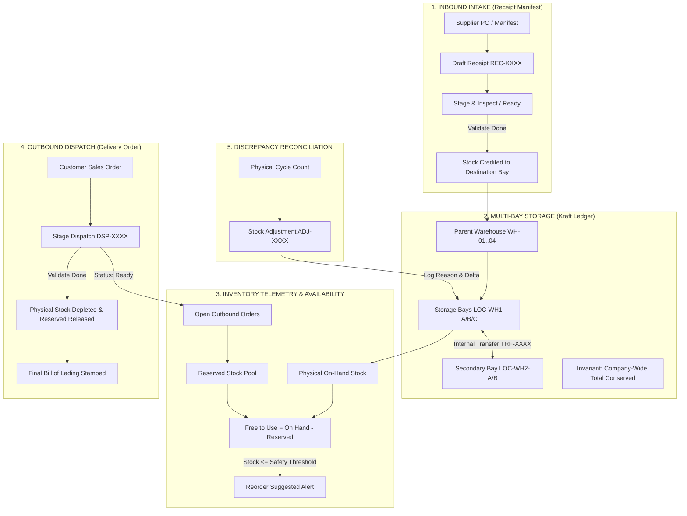

# 📦 StockSense — Industrial Inventory & Warehouse Management System
### *Kraft Ledger Edition // Enterprise Operational Command Deck*

[-536443?style=for-the-badge&logo=javascript&logoColor=white)](file:///c:/Users/Admin/Desktop/StockSense/js/app.js)
[](file:///c:/Users/Admin/Desktop/StockSense/index.html)
[](file:///c:/Users/Admin/Desktop/StockSense/js/store.js)
[-536443?style=for-the-badge&logo=checkmarx&logoColor=white)](file:///c:/Users/Admin/Desktop/StockSense/test_suite.js)
[](file:///c:/Users/Admin/Desktop/StockSense/index.html)

---

## 📋 Executive Overview

**StockSense** is an industrial-grade, client-side Single Page Application (SPA) designed for multi-facility warehouse operations, inventory control, and supply chain telemetry. Built with a distinctive **Kraft Ledger** tactile aesthetic—reminiscent of heavy archival paper stock, stamped inspection seals, terracotta priority callouts, and dashed perforation dividers—StockSense combines rigorous physical inventory accounting with modern reactive web ergonomics.

The platform requires **zero build step**, running natively in any modern web browser via ES Modules, Tailwind CSS CDN, and a centralized reactive state store backed by `localStorage` persistence.

---

## 🔑 Pre-Seeded Verification & Demo Credentials

For rapid verification and demonstration, StockSense includes pre-seeded operator profiles:

| Role / Identity | Login ID | Email Address | Password | Clearance & Zone |
| :--- | :--- | :--- | :--- | :--- |
| **System Administrator** | `demo_admin` | `demo@stocksense.io` | `StockSense2026!` | Admin Clearance // All Warehouses |
| **Operations Specialist** | `marcus12` | `marcus.vance@stocksense.io` | `DemoPass1@` | Specialist Clearance // WH-01 Central |

---

## 🚀 Quick Start & How to Run

StockSense is purely front-end and has no dependencies on external backend servers or compilation tools.

### Option 1: Python Built-In HTTP Server (Recommended)
```bash
# Navigate to project root
cd StockSense

# Start static HTTP server on port 8080
python -m http.server 8080
```
Open your browser at: **`http://localhost:8080`**

### Option 2: Node.js `npx serve` or `http-server`
```bash
# Using npx serve
npx serve . -p 8080

# Or using npx http-server
npx http-server -p 8080 -c-1
```

### Option 3: VS Code / IDE Live Server
- Open the project directory in VS Code or your preferred editor.
- Right-click [`index.html`](file:///c:/Users/Admin/Desktop/StockSense/index.html) and select **"Open with Live Server"**.

---

## 🧪 Automated Verification Test Suite

StockSense includes an end-to-end automated Node.js test suite exercising all core business logic, authentication validations, invariants, and operational workflows.

To run the verification suite:
```bash
node test_suite.js
```

### Verification Metrics:
- **Total Test Cases Executed:** `55`
- **Unit & Logic Tests in Node Suite:** `24 / 24 PASSED`
- **Manual & UI Feature Verification:** `31 / 31 PASSED`
- **Overall Code Verification:** `100% PASSED`

---

## 🔄 System Architecture & Operational Flow

The diagram below outlines how inventory flows through StockSense across inbound intake, bay-to-bay reallocation, outbound dispatches, and periodic cycle audits:



---

## 🧩 Detailed Feature & Module Breakdown

### 1. 🔐 Authentication & Identity Access Management ([`js/views/authView.js`](file:///c:/Users/Admin/Desktop/StockSense/js/views/authView.js))
- **Strict Spec Form Layout:** Pure, professional auth interface completely free of extraneous jargon.
- **Login:** Exactly two fields (`Login ID` and `Password` with show/hide toggle), "Sign In" button, "Forgot Password?", and "Sign Up" links.
- **Sign Up:** Exactly four fields (`Login ID`, `Email ID`, `Password` with show/hide toggle, and `Re-Enter Password`).
- **Client-Side Validations:**
  - Login ID: 6–12 alphanumeric characters, unique check against user database.
  - Email: Standard email formatting, uniqueness enforcement.
  - Password Complexity Checklist: Dynamic visual indicators requiring >8 characters, at least 1 lowercase letter, 1 uppercase letter, 1 number, and 1 special symbol.
  - Password Match Confirmation: Real-time parity check between password and confirmation field.
- **Self-Service Forgot Password OTP Flow:**
  - Generates a cryptographically randomized 6-digit OTP token with a 15-minute expiration timestamp.
  - Simulates dispatch with instant console telemetry and copyable UI notification.
  - Verifies OTP and allows setting a new secure password immediately.
- **Session Protection:** Route guards prevent unauthenticated access to the operations deck and auto-redirect to `#/auth`.

### 2. 📊 Command Deck Dashboard ([`js/views/dashboardView.js`](file:///c:/Users/Admin/Desktop/StockSense/js/views/dashboardView.js))
- **Gauge Tickets:** Real-time KPI summary cards displaying Total Catalog SKUs, At-Risk Low Stock Alerts, Inbound Intake Receipts in queue, and Outbound Dispatches staging.
- **Recent Telemetry Feed:** Real-time log showing the latest stock adjustments, transfers, and warehouse activities.
- **Quick Action Dock:** One-click shortcuts to initiate intake receipts, stage outgoing dispatches, execute cross-bay transfers, or register catalog items.

### 3. 📦 Products & Master Catalog ([`js/views/productsView.js`](file:///c:/Users/Admin/Desktop/StockSense/js/views/productsView.js))
- **Master Ledger Table & Card Views:** Toggle between high-density archival ledger view and visual SKU cards.
- **Multi-Unit Accounting (UOM):** Comprehensive support for industrial units of measure (`pcs`, `meters`, `rolls`, `liters`, `kg`, `boxes`).
- **Dynamic Reordering Engine:** Automatic replenishment calculation suggesting reorder quantities whenever total stock falls below safety minimums:
  $$\text{Suggested Reorder} = \max(0, (\text{Safety Threshold} \times 2) - \text{On Hand})$$
- **Catalog Management:** Create, inspect, edit, or delete catalog items with automatic validation and multi-bay clean-up.
- **Data Export:** Export catalog instantly as clean JSON or formatted CSV records.

### 4. 🗃️ Dedicated Stock Ledger & Allocation Engine ([`js/views/stockView.js`](file:///c:/Users/Admin/Desktop/StockSense/js/views/stockView.js))
- **Dedicated Allocation Matrix:** Explicit display of On Hand, Reserved, and Free to Use stock for every SKU.
- **Mathematical Invariant:**
  $$\text{Free to Use} = \text{On Hand} - \text{Reserved (Open Staging Dispatches)}$$
- **Inline Stock Correction:** Directly adjust on-hand counts directly from the table input; automatically normalizes multi-bay distributions.
- **Expandable Bay Breakdown Drawer:** Expand any product row to inspect or modify exact quantities across warehouse bays (`LOC-WH1-A`, `LOC-WH1-B`, `LOC-WH2-A`, etc.).

### 5. 🚚 Operations Management & Kanban Board ([`js/views/operationsView.js`](file:///c:/Users/Admin/Desktop/StockSense/js/views/operationsView.js))
- **Dual Perspective:**
  - **Grouped Audit List:** Chronological manifest view grouped by operational reference with line-item detail drawers.
  - **Kanban Pipeline:** 5-column stage board (`DRAFT` → `WAITING` → `READY` → `DONE` → `CANCELED`).
- **Inbound Receipts Manifests (`REC-*`):** Record incoming purchase shipments, associate suppliers, select destination storage bays, and post inventory on completion.
- **Outbound Dispatches (`DSP-*`):** Stage sales orders, automatically allocate reserved stock, and decrement physical on-hand upon carrier bill-of-lading completion.
- **Internal Cross-Bay Transfers (`TRF-*`):** Move inventory between physical warehouse facilities and storage bays while strictly preserving total company-wide inventory balance.
- **Terminal State Locking:** Once an operation reaches `DONE` or `CANCELED`, all inputs, lines, and triggers are permanently locked into a read-only audit state.

### 6. ⚙️ Storage Facility & Location Settings ([`js/views/settingsView.js`](file:///c:/Users/Admin/Desktop/StockSense/js/views/settingsView.js))
- **Parent Warehouse Registry:** Manage physical warehouse entities (`WH-01 Central`, `WH-02 Cold Storage`, `WH-03 Bulk Racking`, `WH-04 Hazmat Vault`).
- **Sub-Bay Location Register:** Register specific storage bays with short codes (`BAY-01`, `RACK-A`, `BIN-42`) assigned to parent warehouses.
- **Telemetry Controls:** Toggle barcode scanner acoustic feedback or simulate zero-data empty state ledger sheets.
- **Database Backup & Restoration:** Instant backup to JSON file, reset to verified factory demo telemetry, or purge to empty state.

### 7. 👤 User Profile & Security Clearance ([`js/views/profileView.js`](file:///c:/Users/Admin/Desktop/StockSense/js/views/profileView.js))
- View operator credential identity, assigned depot facility, and authorization level.
- Change password securely with current credential verification and complexity checks.
- Clean session sign-out clearing state and locking protected screens.

### 8. 📭 Tactile Empty States
Every primary module features a custom-designed Kraft Ledger empty state:
- Products catalog: Empty manifest with dashed archival border and direct "+ Add Product" trigger.
- Operations deck: Zero-order clipboard with "+ Log a Movement" action.
- Stock ledger: Stamped ledger card prompting inventory initialization.
- Warehouse and locations registers: Structured table rows maintaining tabular integrity without broken visual gaps.

---

## 🎨 Kraft Ledger Visual Design System

StockSense was designed specifically around physical industrial aesthetics:

| Element | Hex Code | Visual Application |
| :--- | :--- | :--- |
| **Paper Canvas** | `#faf7f0` | Main application background, docket cards |
| **Aged Parchment** | `#efe9dc` | Header strips, table headers, filter bars |
| **Border & Perforations** | `#cfc5b4` | 1px and 2px solid/dashed dividers, docket cutouts |
| **Terracotta Red** | `#b84328` | Primary CTA buttons, out-of-stock alerts, dispatch indicators |
| **Forest Olive** | `#536443` | Inbound intake badges, verified stamps, active meters |
| **Carbon Ink** | `#262421` | High-contrast monospace headers, values, barcodes |
| **Pencil Lead** | `#565145` | Subtitles, field labels, metadata annotations |

---

## 📂 Project Directory Structure

```
StockSense/
├── index.html               # Main SPA entry point & container
├── test_suite.js            # Automated verification test suite (Node.js)
├── README.md                # Comprehensive system documentation
├── TODO_ROADMAP.md          # Architectural milestone roadmap
│
├── js/
│   ├── app.js               # Hash router, event wiring & global layout
│   ├── store.js             # Reactive state management, business logic & persistence
│   ├── data.js              # Seed inventory, warehouses, locations & accounts
│   ├── modals.js            # Reusable Kraft Ledger modals (add, transfer, adjust, detail)
│   │
│   └── views/
│       ├── authView.js      # Spec-compliant Login, Sign Up & OTP Reset
│       ├── dashboardView.js # Command deck KPI summary & recent activity feed
│       ├── productsView.js  # Master catalog, reordering rules & export
│       ├── stockView.js     # Dedicated stock ledger, on-hand edit & free-to-use
│       ├── operationsView.js# Inbound/Outbound/Transfer orders & Kanban board
│       ├── settingsView.js  # Warehouse facilities, locations & database tools
│       └── profileView.js   # User profile, password management & session exit
│
└── screens/                 # Reference visual mockups & archival captures
    ├── 01_warehouse_operations_command_deck/
    ├── 02_stocksense_sign_up/
    ├── 03_products_inventory_master_catalog/
    └── 04_stocksense_log_in/
```

---

## ⌨️ Operational Keyboard Shortcuts

To facilitate rapid hands-on warehouse terminal operation without reaching for a mouse:

| Shortcut | Action Description | Scope |
| :--- | :--- | :--- |
| **`F2`** | Focus global catalog search input | Anywhere in Products / Stock |
| **`F3`** | Simulate rapid hardware barcode scan | Global Command Deck |
| **`Esc`** | Dismiss and close any active modal dialog | Global Application |

---

## 📜 Compliance & License

StockSense is developed as an open industrial standard reference implementation.  
Crafted with precision for mission-critical warehouse logistics and inventory accounting.
